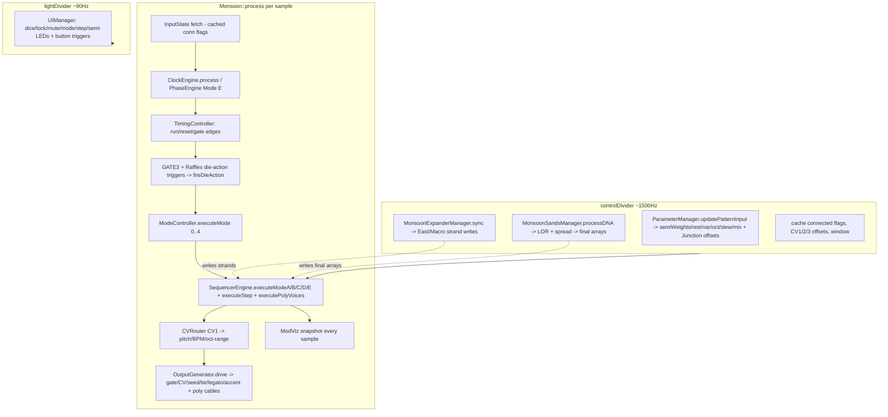

# Monsoon (VCV Rack Plugin Suite) — Complete Codebase Mental Model

> Deep-parse of every file the [`plugins/Melodicer/Makefile`](plugins/Melodicer/Makefile:1) compiles:
> `src/*.cpp`, `src/dsp/engines/*.cpp`, `src/dsp/managers/*.cpp`, `src/dsp/gates/*.cpp` — plus all headers and DSP/UI utilities they depend on.

## 1. Build system (verified)

| File | Role |
|------|------|
| [`Makefile`](Makefile:1) | Root Rack SDK — builds libRack + standalone. `plugins` target runs `make` in every `plugins/*` dir. |
| [`plugin.mk`](plugin.mk:1) | SDK helper — `jq` reads `plugin.json`, sets `-I$(RACK_DIR)/include`, links `-lRack`, includes `arch.mk`/`dep.mk`/`compile.mk`. Builds `plugin.<ext>` → `*.vcvplugin`. |
| [`plugins/Melodicer/Makefile`](plugins/Melodicer/Makefile:1) | **The plugin's own Makefile.** C++17 (fold expr in [`SvgPanelKit.hpp`](plugins/Melodicer/src/ui/SvgPanelKit.hpp:200)); `-flto -O1 -ffast-math -march=native`. Compile globs: `src/*.cpp`, `src/*.c`, `src/dsp/engines/*.cpp`, `src/dsp/managers/*.cpp`, `src/dsp/gates/*.cpp`. Distributables: `res`, `LICENSE*`, `presets`. |
| [`plugin.json`](plugins/Melodicer/plugin.json:1) | slug `"Monsoon"`, v2.0.1, author Dr Rodney Hoskinson, brand `dot.modular`, 13 modules. |

Entry: `plugin.cpp` is a stub — real `init()` at [`src/Monsoon.cpp:968`](plugins/Melodicer/src/Monsoon.cpp:968) registers 13 models.

## 2. Architecture (full data-flow)

### The `process()` per-sample loop ([`Monsoon.cpp:446`](plugins/Melodicer/src/Monsoon.cpp:446))
1. **Audio-rate input fetch** into `InputState` (gated by `cached*Connected` flags).
2. **Clock** (`ClockEngine` or `PhaseEngine` in Mode E) → `pulseEdge`/`sixteenthEdge`/`quarterEdge` + bpm.
3. **Run/Reset gate** via `TimingController`; on reset → `handleRestart` (reseed policy: CV S&H if SEED patched else morph-preserving reseed-roll).
4. **Gate edge detection**; GATE3 + Raffles 14 die-action gates → `fireDieAction(DA_*)`.
5. **Shophouse sync** every frame (scale + Conservation lock); boundary-quantised front switch on wrap.
6. **Mode dispatch** (`executeMode(0..4)`) on the relevant edge; Mode E jump/scrub replays crossed 1/16s.
7. **CV routing** (CV1 pitch/BPM/oct-range, except Mode E where CV1 is phase).
8. **OutputGenerator.drive** — gate/CV/seed/tie/legato/accent + poly cables (16ch).
9. **ModViz snapshot** every sample (per-lane modulated values for arcs).
10. **lightDivider** (~90Hz): UIManager lights + button triggers (dice/trial/lastdice/lock/mute/mode) + step/semi LEDs + fader cache + `refreshVisualCache`.
11. **controlDivider** (~1500Hz): `updateExpanderPointers`, Raffles gates, `updatePatternInput`, `processDNA`, `expanderManager.sync`, cache flags, CV1/2/3 offsets, window.

## 3. Core module — `src/Monsoon.{hpp,cpp}`

[`Monsoon.hpp`](plugins/Melodicer/src/Monsoon.hpp:855) is a **facade**: `struct Monsoon : Module` holds `SequencerEngine engine` and a forest of `unique_ptr<Manager>`, then exposes ~80 `T&` reference-aliases (`holdRemain`, `stepIndex`, `rhythmRandom`, `locked`, …) that bind directly into `engine`/`engine.pe`/`engine.gs`. So the module body is mostly delegation.

- **`MonsoonIds` namespace** = the canonical param/input/output/light ID enums, shared with every expander (stable integer contract). ~`NUM_PARAMS` ≈ 600+ (huge poly LOR/interp/Macro-send/atten banks).
- **`ExpanderMessage` structs** (`MonsoonRightMessage`/`MonsoonLeftMessage`) defined but **mostly unused** — expanders are passive; the parent reads their params/inputs directly via cached pointers (no message-passing).
- **Die-action vocabulary** (`DieAction` enum + `fireDieAction`) — single DRY definition fired by GATE3 (menu-routed) AND Raffles's 14 dedicated gates. Covers trial/redice/livesrc/livestatic/reseed/lastdice/lasttrial.
- **Effective poly rest/accent** = single resolver `getEffectivePolyRest/Accent` (base knob + Causeway CV×att, clamped) — the **only** writer feeds `voices[i].restProb` right before `executePolyVoices`. No cached-effective copies (the documented fix for three drift/clobber bugs).
- **`ModViz` snapshot** published every sample for the mod-arc overlays (per-lane gating so an unmodulated knob never trails).

## 4. Engines — `src/dsp/engines/` + `src/dsp/gates/`

### [`PatternEngine`](plugins/Melodicer/src/dsp/engines/PatternEngine.hpp:69) (Rack-port-free stochastic core)
- Owns **both Philox RNG streams** (rhythm + melody), keyed by the seed float. Draws are **counter-addressable**: draw N = Philox block `[N*1024, N*1024+1024)`, so the stream is **reversible/random-access** (foundation for Mode E reverse/scrub).
- Output arrays per strand × 16 steps: `rhythmRandom`, `variationRandom`, `legatoRandom`, `accentRandom`, `melodyRandom`, `octaveRandom` (+ poly `[15][16]` variants). `finalRandomByStrand(strand,step)` = table-driven member-pointer addressing.
- **Playable dice / A-B slew** (the "MeloDicer-with-morph" extension):
  - `*LockedA[]` = committed groove, `*CandB[]` = candidate. **SLEW consumed at roll**: `B = A + slew*(T-A)` (low slew = bounded random walk; slew=1 = full replace). **MIX** = live continuous A↔B blend (recomputed every process).
  - **MAIN** roll promotes B→A (A walks); **TRIAL** roll anchors A (audition); **RESEED-ROLL** reseeds keeping the morph; **LAST**/* inverts the draw index (Normal-mode only — blocked on reversible streams).
  - `sandsActive` flag: when a Sands visual owns the spread→final stage, slew leaves the public arrays for Sands to write; otherwise slew copies `slewedDraw → final`.
- `redrawRhythm/Melody` regenerate at phrase boundaries; `applyPendingSeedsAndRedraw` resolves pending seed/roll/trial/reseed-roll/realtime.
- Mode switch (dice↔realtime) does **lossless A/B buffer snapshot+restore** (preserves slew morph position).

### [`SequencerEngine`](plugins/Melodicer/src/dsp/engines/SequencerEngine.hpp:58) (step/voice execution)
- Embeds `PatternEngine pe`, `GateState gs`, **15 `PolyVoice`s** (`voices[15]`, each with own `GateState` + rest/accent prob).
- **`MonoDecision`** enum (MidNote/Rest/Tie/Legato/LegatoMax/NewNote) — the mono conductor's verdict; poly voices react to it.
- **`executeStep`** ([`.cpp:206`](plugins/Melodicer/src/dsp/engines/SequencerEngine.cpp:206)) — the decision heart:
  - MidNote guard (holdRemain≥1 or gatePulseRemain>0) → poly ticks, returns.
  - Fractional-tail rules (1/4T/1/8T/1/32 can't *lead* a legato, can *receive* one, can't be a middle tie).
  - **Leading-edge legato** (toggle `legatoLeadingEdge`, default ON this branch): the previous note's onset commitment `gs.slurForward` governs the join instead of a fresh roll. `noteCanLeadLegato` (integer-step lengths only) gates it.
  - `restBeatsLegato` (default ON: rest cancels slur) + `boundaryInterrupt` (default OFF: gate carries across loop).
  - Accent decided at note *start*; sustained/inherited through tie/midnote.
  - **`StrandWriter` ledger** (debug): `setStrand(role,strand,...)` asserts exactly-one-writer-per-strand-per-block (the guard that would catch Mono+Macro clobbering). Release = warn+last-writer-wins (load-time transient tolerance).
- **LOR storage unified**: `lorStore_[16 voices][6 editor lanes][3 items]` — one array replacing scattered mono/poly LOR. Editor-lane == strand index (identity); poly uses `ENGINE_LANE_TO_EDITOR` at the single storage boundary.
- **`getStrandIdx(tick, len, off, rot)`** = `((tick+rot) mod len + off) mod 16` — the drifting-polymeter DNA index. `totalStepsElapsed` (mod LCM 720720) drives it; steps ± with direction in Mode E.
- **Poly execution** (`executePolyVoice`): only acts on `monoGateStart` (NewNote or Legato-from-dead). Each voice rolls its own rest (own rest LOR), draws own pitch (own mel/oct LOR), own accent (own accent LOR). On mono sustain/tie/rest, poly sticks to its current role. Isolated-teal guard: mono slurs but poly had no held gate → fresh trigger not slide.
- **Modes**: A=clock 1/16, B=gate1-driven, C=quarter-note quantizer (CV2), D=continuous gate2 quantizer, E=phase-ramp (forward+reverse+jump-replay).
- **Poly probability outs**: `polyLaneProbability`/`masterLaneProbability`/`polyLaneProbabilityAtStep` feed the Sands visual CV outs.

### [`GateState`](plugins/Melodicer/src/dsp/gates/GateState.cpp:1)
- `holdRemain` = whole-step DECISION counter; `gatePulseRemain` = PPQN-grid-pulse gate-close countdown (the **sole** gate-close mechanism — replaces the old seconds timer; triplets/1/32 are integer pulse counts at 24/48/96 PPQN).
- `triggerNote`/`slideNote`/`slideMax`/`extendHold`/`rest`/`tick`/`tickPulse`/`process`. `slurForward` = leading-edge legato commitment. `semiPlayRemain[12]` = LED flash timers.

### [`ClockEngine`](plugins/Melodicer/src/dsp/engines/ClockEngine.cpp:1) / [`PhaseEngine`](plugins/Melodicer/src/dsp/engines/PhaseEngine.hpp:30)
- ClockEngine: unified PPQN grid (24/48/96), `pulsesPer16th = ppqn/4`. External clock assumed at exact PPQN; internal subdivides. Emits `pulseEdge`/`sixteenthEdge`/`quarterEdge` + bpm.
- PhaseEngine (Mode E): external phase ramp 0→1 = one bar. Shortest-path delta (wrap-safe), velocity→bpm, jump detection (`jumpSixteenths` for replay), `reverse` flag. Same output contract as ClockEngine + reverse.

## 5. Managers — `src/dsp/managers/` (13 files)

All constructed in `Monsoon()` and held by `unique_ptr`. Single-responsibility; mostly thin orchestration over the engine.

| Manager | File | Responsibility |
|---------|------|----------------|
| **ParameterManager** | [`MonsoonParameterManager.hpp`](plugins/Melodicer/src/dsp/managers/MonsoonParameterManager.hpp:22) | Knob+CV+expander value getters (big-5, slew, mix, octave, semitones, poly rest/accent). Holds `cv2Offsets[5]`, `cv3Offsets[4]`, `junctionOffsets[5]`, `cv1Lo/HiOffset`, `cv1BpmOffset`. Per-lane `*Modulated()` predicates gate the mod-arcs. |
| **ScaleManager** | [`MonsoonScaleManager.hpp`](plugins/Melodicer/src/dsp/managers/MonsoonScaleManager.hpp:22) | `activeScaleMask`, `getSemitoneWeight` (zeros out-of-scale when `lockScaleNotes`), `redistributeWeights`, `calculateMask`. `MONSOON_SCALES` table. |
| **ModeController** | [`MonsoonModeController.hpp`](plugins/Melodicer/src/dsp/managers/MonsoonModeController.hpp:29) | `executeMode(0..4)` dispatch; assembles `currentPatternInput`; `postExecute_` (phrase boundary → `onPhraseBoundary_`, then `executePolyVoices`); `updatePolyVoiceRest_` pulls from the single resolver. |
| **TimingController** | [`MonsoonTimingController.hpp`](plugins/Melodicer/src/dsp/managers/MonsoonTimingController.hpp:23) | Run/reset gate processing, 1ms reset pulse, gate1/gate2 assignment (4 modes each), edge detection. |
| **CVRouter** | [`MonsoonCVRouter.hpp`](plugins/Melodicer/src/dsp/managers/MonsoonCVRouter.hpp:21) | CV1 modes: add/transpose-quantized/mod-lo/mod-hi/BPM. Transient lo/hi offsets. |
| **OutputGenerator** | [`MonsoonOutputGenerator.hpp`](plugins/Melodicer/src/dsp/managers/MonsoonOutputGenerator.hpp:25) | State→voltage: gate (mute-masked), tie/legato/accent gates, poly cables (16ch, ch0=mono), Changi per-voice jacks. |
| **UIManager** | [`MonsoonUIManager.hpp`](plugins/Melodicer/src/dsp/managers/MonsoonUIManager.hpp:23) | All lights + button triggers (dice/trial/lastdice/lasttrial/lock/mute/mode). |
| **PersistenceManager** | [`MonsoonPersistenceManager.hpp`](plugins/Melodicer/src/dsp/managers/MonsoonPersistenceManager.hpp:11) | `toJson`/`fromJson` static. Restores seeds, draw counters, A/B buffers, all modes/toggles. |
| **MonsoonSandsManager** | [`MonsoonSandsManager.hpp`](plugins/Melodicer/src/dsp/managers/MonsoonSandsManager.hpp:19) | `processDNA` (control rate): scramble/reset triggers + **the mono spread→final stage** (writes `rhythmRandom` etc. via `MonoSandsParameterManager::writeFinal`). |
| **MonsoonExpanderManager** | [`MonsoonExpanderManager.hpp`](plugins/Melodicer/src/dsp/managers/MonsoonExpanderManager.hpp:43) | **Chain-walk discovery**: scans both sides (depth≤12), one pointer per type (first match, left-before-right). Stops at foreign/Monsoon. `fillPresence` = single SandsTopology authority. `sync(engine, spreadInterpMono)` = East/Macro strand writes + Macro global publish. |
| **MonsoonConfigurator** | [`MonsoonConfigurator.hpp`](plugins/Melodicer/src/dsp/managers/MonsoonConfigurator.hpp:9) | `setup(Monsoon*)` — all `configParam`/`configInput`/`configOutput`/`configLight` boilerplate (the ~600 params). |
| **SpreadManager** | [`SpreadManager.hpp`](plugins/Melodicer/src/dsp/managers/SpreadManager.hpp:47) | Display-side spread interpolation (AVERAGE_POLY / MONO_DRAW). Cached 3×16 average grid (checksum-guarded). `effectiveTarget()` reads the engine's single-source `spreadInterpMono`. |
| **MonoSandsParameterManager** | [`MonoSandsParameterManager.hpp`](plugins/Melodicer/src/dsp/managers/MonoSandsParameterManager.hpp:9) | Mono V1 spread: `spreadValue(lane,step)` via `SpreadInterp::interpolate`; `writeFinal()` writes the 6 mono final arrays + sets `sandsActive`. `polyAverageInclMono` includes mono in the ensemble. |
| **PolySandsParameterManager / PolyVoiceSandsParameterManager** | (same dir) | Poly-voice analogues of the mono Sands param manager (per-voice LOR/spread → poly final arrays). |

## 6. DSP utilities — `src/dsp/`

| File | Purpose |
|------|---------|
| [`PhiloxRng.hpp`](plugins/Melodicer/src/dsp/PhiloxRng.hpp:92) | Philox4x32-10 (Random123) + 4x64 variant. Counter-based, stateless, addressable — `at(pos)`/`atUniform(pos)` pure fn of (counter,key). Key conditioning (SplitMix64) so weak 0..10V CV seeds mix well. **The RNG PatternEngine uses.** |
| [`SquaresRng.hpp`](plugins/Melodicer/src/dsp/SquaresRng.hpp:70) | Widynski Squares counter-based RNG. Same interface family; alternative (Philox is the live one). |
| [`LaneMapping.hpp`](plugins/Melodicer/src/dsp/LaneMapping.hpp:28) | **Single source of truth** for editor-lane ↔ engine-strand ↔ poly-engine-lane orderings. `STRAND_MELODY=0..STRAND_LEGATO=5`; `MONO_LANE_TO_STRAND` (identity); `ENGINE_LANE_TO_EDITOR[4]` / `EDITOR_TO_ENGINE_LANE[4]`. |
| [`NoteValues.hpp`](plugins/Melodicer/src/dsp/NoteValues.hpp:37) | Single note-length table: 1/1,1/2,1/4,1/4T,1/8,1/8T,1/16,1/32. `noteValueSteps(idx)`, `noteCanLeadLegato` (integer-step only). |
| [`ScaleList.hpp`](plugins/Melodicer/src/dsp/ScaleList.hpp:28) | Boundary-quantised (scale,root) list for Shophouse: `setPending`/`commitAtBoundary`. Pure data model. |
| [`SpreadResolver.hpp`](plugins/Melodicer/src/dsp/SpreadResolver.hpp:39) | Pure arithmetic for effective spread amount (base + ownCv + eastCv + macroSendDelta, step-clamped). Delegated lane mirrors Macro. |
| [`SpreadInterp.hpp`](plugins/Melodicer/src/dsp/SpreadInterp.hpp:30) | Single definition of spread interpolation: bipolar (>0 converge to target, <0 invert toward 1−target), AVERAGE_POLY vs MONO_DRAW. Operates on slewed draws. |
| [`VoiceResolver.hpp`](plugins/Melodicer/src/dsp/VoiceResolver.hpp:29) | Uniform 16-voice addressing: V1=mono, V2..V16=poly. `voiceSlot`/`polyBankIndex` conventions (with static_asserts guarding the off-by-one). Read-only shadow. |
| [`SandsTopology.hpp`](plugins/Melodicer/src/dsp/SandsTopology.hpp:33) | Ownership/lock/editable authority. `Config` enum (EMPTY/MONO/EAST/MACRO_SOLE/.../MONO_EAST_MACRO). `owner(voice,lane)` → Role. `editableOn`/`lockedOn`/`writesEngine`. The named-config guard against the Mono+Macro clobber. |

## 7. Expanders — `src/*.cpp` (11 modules)

**All expanders are passive config shells** — `process()` is empty; the parent Monsoon reads their params/inputs directly via cached pointers and writes their outputs. `findMonsoonEitherSide` (chain-walk) lets visual expanders bind regardless of side/intermediates.

| Module | Header | Role |
|--------|--------|------|
| **Interchange** | [`MonsoonInterchangeExpander.hpp`](plugins/Melodicer/src/MonsoonInterchangeExpander.hpp:11) | 12 semitone CV + atten, oct-lo/hi CV + atten. Feeds `ParameterManager`. |
| **Raffles** | [`MonsoonRafflesExpander.hpp`](plugins/Melodicer/src/MonsoonRafflesExpander.hpp:12) | 4 CV (slew R/M, mix R/M) + 14 die-action gates → `fireDieAction`. |
| **Junction** | [`MonsoonJunctionExpander.hpp`](plugins/Melodicer/src/MonsoonJunctionExpander.hpp:10) | 5 big-5 CV + atten → `junctionOffsets`. |
| **Straits** | [`MonsoonStraitsExpander.hpp`](plugins/Melodicer/src/MonsoonStraitsExpander.hpp:39) | Base poly expander: 15 REST + 15 ACCENT knobs + 3 poly-cable outs (gate/CV/accent, 16ch, ch0=mono). |
| **Causeway** | [`MonsoonCausewayPolyExpander.hpp`](plugins/Melodicer/src/MonsoonCausewayPolyExpander.hpp:21) | Poly REST/ACCENT mod CV in (16ch) + per-voice + global atten. Summed into `getEffectivePoly*`. |
| **Changi** | [`MonsoonChangiExpander.hpp`](plugins/Melodicer/src/MonsoonChangiExpander.hpp:25) | Per-voice breakout: 15×(gate/CV/accent) individual jacks. |
| **Shophouse** | [`MonsoonShophouseExpander.hpp`](plugins/Melodicer/src/MonsoonShophouseExpander.hpp:39) | Scale expander: 4 fronts (scale+root), Conservation toggle, INDEX_CV (boundary-quantised). Owns a `ScaleList`. |
| **Lantern** | [`Lantern.cpp`](plugins/Melodicer/src/Lantern.cpp:54) | Read-only 16-voice note visualiser. Owns `cells[16][16]` ring buffer (type/pitch/length/held/accent/leadsLegato). Grid + piano-roll views. Pure observer. |
| **Sands Visual (Mono)** | [`MonsoonSandsVisualExpander.hpp`](plugins/Melodicer/src/MonsoonSandsVisualExpander.hpp:112) | Mono V1 Sands editor: 6 lanes × LOR(LEN/OFF/ROT) + 4 spread + owner cells (Macro-delegation) + 6 prob-outs. `process()` writes prob-outs (S&H or continuous). |
| **East (StraitsEastSandsVisual)** | [`StraitsEastSandsVisual.hpp`](plugins/Melodicer/src/StraitsEastSandsVisual.hpp:135) | Tabbed 15-voice poly Sands editor. Per-voice LOR + interp (spread) + owner + 12-atten display proxies + 4 poly prob-outs. `polySpreadEffective[15][4]` published by `expanderManager.sync`. |
| **Macro (StraitsSandsMacroVisual)** | [`StraitsSandsMacroVisual.hpp`](plugins/Melodicer/src/StraitsSandsMacroVisual.hpp:152) | Global Macro Sands editor. Global LOR + 4 spread + 16 atten + per-voice mix-in sends (`MACRO_SEND_*`, 180 params) + PRE/POST taps + 4 poly prob-outs. Publishes `macroBase`/`macroCVDelta`/`macroSendDelta` for the East/Mono blend equation. |

**Retired** (source kept in `src/deprecated/`, commented out of `init()`): SandsExpander, StraitsSands, DeepStraitsSandsEast/West, StraitWest, StraitsWestSandsVisual.

## 8. UI layer — `src/ui/`

| Widget | File | Role |
|--------|------|------|
| **SvgPanelKit** | [`SvgPanelKit.hpp`](plugins/Melodicer/src/ui/SvgPanelKit.hpp:62) | Variadic-template composable SVG binding framework (`Compose<T, ShapeQuery, Bind, Reload>`). Binds widgets to named SVG shapes; variadic `bindParams<Trimpot>("atten_", ids...)` (the C++17 fold expr). Dev live-reload. **The C++17 requirement source.** |
| **SandsVisualEditorV4** | [`SandsVisualEditorV4.hpp`](plugins/Melodicer/src/ui/SandsVisualEditorV4.hpp:26) | The probability-grid editor widget (16 bars/lane). LOR window handles (start/end/rotation/window drag), display-vs-edit LOR split (non-destructive under CV), per-lane lock, undo/redo, preset bank, cursor cues. `VoiceState` = 6 `ProbabilityLane`s. |
| **MonsoonWidget** | [`MonsoonWidget.hpp`](plugins/Melodicer/src/MonsoonWidget.hpp:18) | Main module widget (40HP). `PendingModArc` collection → ModArcOverlay attached after all knobs. Theme, context menu, dev live-reload. |
| **OwnerCell** | [`OwnerCell.hpp`](plugins/Melodicer/src/ui/OwnerCell.hpp:24) | Per-lane ownership toggle (filled=Macro, outline=local) with lock glyph. The "17th step" of a Sands lane. |
| **ModArcOverlay** | [`ModArcOverlay.hpp`](plugins/Melodicer/src/ui/ModArcOverlay.hpp:21) | Transparent overlay: set→modulated arc on knobs (radial) or tick on sliders. Per-lane `isActive` gating. |
| **TabButton(Group)** | [`TabButton.hpp`](plugins/Melodicer/src/ui/TabButton.hpp:22) | Voice-selection tabs (V2..V16) for East/Macro. |
| **ConnectMark** | [`ConnectMark.hpp`](plugins/Melodicer/src/ui/ConnectMark.hpp:15) | Brand-mark connection indicator (full colour if claimed, greyed if not). |
| **GoldPolyPort** | [`GoldPolyPort.hpp`](plugins/Melodicer/src/ui/GoldPolyPort.hpp:19) | PJ301M + gold insert + Singapore-red ring = poly-out signature jack. |
| **OutputAccent** | [`OutputAccent.hpp`](plugins/Melodicer/src/ui/OutputAccent.hpp:11) | Theme-aware contrasting region behind output jacks. |
| **RedScrew** | [`RedScrew.hpp`](plugins/Melodicer/src/ui/RedScrew.hpp:10) | Brand red-disc screw (NanoVG, theme-independent). |
| **DimmableTrimpot** | [`DimmableTrimpot.hpp`](plugins/Melodicer/src/ui/DimmableTrimpot.hpp:23) | Trimpot with `dimWhen`/`lockWhen`/`displayValueFn` — display/store split so a delegated lane shows the owner's value without clobbering the local store. |
| **VisualExpanderHelpers** | [`VisualExpanderHelpers.hpp`](plugins/Melodicer/src/ui/VisualExpanderHelpers.hpp:9) | `findMonsoonEitherSide`, `isClaimedExpander`, `calcPlayhead` (= `getStrandIdx`), `setPolyVoicePlayheads`/`setMacroPolyPlayheads`. |

Panel SVGs are generated by Python scripts in [`panel_src/`](plugins/Melodicer/panel_src:1) (`gen_*.py`); assets in [`res/`](plugins/Melodicer/res:1); tests in [`test/`](plugins/Melodicer/test:1) (standalone Rack-free unit tests for engines/RNG/spread/topology).

## 9. Cross-cutting invariants (the "load-bearing" design rules)

1. **Strand = editor lane = storage column.** Six strands (MEL/OCT/REST/ACC/VAR/LEG). All lane↔strand↔engine conversions route through [`LaneMapping.hpp`](plugins/Melodicer/src/dsp/LaneMapping.hpp:28). Never hand-roll.
2. **Exactly one writer per strand per block.** Debug `StrandWriter` ledger asserts it; release warns. `SandsTopology::owner()` is the authority for who writes which (voice,lane). MACRO_SOLE is the clobber-guard config.
3. **Single resolver for effective poly rest/accent** (`getEffectivePolyRest/Accent`) — no cached-effective copies (three drift bugs died here).
4. **Single source of truth for spread-interp mode** = `PatternEngine::spreadInterpMono`, mirrored from the Monsoon menu each frame; every display SpreadManager reads it (no per-widget push).
5. **Single presence authority** = `MonsoonExpanderManager::fillPresence` — never a widget's self-knowledge.
6. **Sands owns the spread→final stage** when present (`sandsActive=true`); else slew copies slewedDraw→final.
7. **Philox addressability** = the reversible/random-access foundation. LastDice/trial blocked on reversible streams (would void the index↔phase contract).
8. **Gate-close = PPQN pulse countdown only** (`tickPulse`); no seconds timer. All note lengths are integer pulse counts at 24/48/96 PPQN.
9. **Display/store separation** (`DimmableTrimpot::displayValueFn`) — a delegated lane shows the owner's value without clobbering the local stored value; reclaiming reverts automatically.
10. **Param IDs are a stable integer contract** — new params appended at END (saved-patch safety); the huge MACRO_OWN/SEND/ATTEN banks live in the shared `MonsoonIds` namespace and are configured by whichever module owns them.

## 10. Where to look for common tasks

- **Add a new module**: new `src/X.cpp` + `X.hpp` (config shell + `createModel`), register in `init()` ([`Monsoon.cpp:968`](plugins/Melodicer/src/Monsoon.cpp:968)), add to `plugin.json`, add a discovery branch in [`MonsoonExpanderManager::update`](plugins/Melodicer/src/dsp/managers/MonsoonExpanderManager.hpp:70).
- **Add a parameter**: append to the relevant enum in `MonsoonIds` (at END for ABI), `configParam` in [`MonsoonConfigurator`](plugins/Melodicer/src/dsp/managers/MonsoonConfigurator.hpp:9), persist in [`PersistenceManager`](plugins/Melodicer/src/dsp/managers/MonsoonPersistenceManager.hpp:11).
- **Change note lengths**: edit [`NoteValues.hpp`](plugins/Melodicer/src/dsp/NoteValues.hpp:37) only (single source).
- **Change a lane/strand mapping**: edit [`LaneMapping.hpp`](plugins/Melodicer/src/dsp/LaneMapping.hpp:28) only.
- **Change ownership/topology rules**: edit [`SandsTopology.hpp`](plugins/Melodicer/src/dsp/SandsTopology.hpp:33); consumers already route through it.
- **Change spread arithmetic/interpolation**: edit [`SpreadResolver.hpp`](plugins/Melodicer/src/dsp/SpreadResolver.hpp:39) / [`SpreadInterp.hpp`](plugins/Melodicer/src/dsp/SpreadInterp.hpp:30).
- **Change step decision logic**: [`SequencerEngine::executeStep`](plugins/Melodicer/src/dsp/engines/SequencerEngine.cpp:206).
- **Change stochastic generation**: [`PatternEngine::redrawRhythm/Melody`](plugins/Melodicer/src/dsp/engines/PatternEngine.cpp:198).
- **Add a panel**: Python generator in [`panel_src/`](plugins/Melodicer/panel_src:1) → SVG in [`res/panels/`](plugins/Melodicer/res/panels:1); bind via `SvgPanelKit`.

## 11. Panel generation pipeline — `panel_src/` + `res/`

### Three coexisting architectures
1. **JSON pipeline** ([`gen_layout.py`](plugins/Melodicer/panel_src/gen_layout.py:1) + [`layouts/raffles.json`](plugins/Melodicer/panel_src/layouts/raffles.json:1)) — the modern path. JSON is the single source of truth; the generator emits BOTH the SVG (with invisible `id="input_…"`/`param_…` marker shapes) AND `src/gen/<Struct>.gen.hpp` constexpr mm coordinates. **Only Raffles uses this.** Validates all control ids against the enum.
2. **Bespoke generators** (one `gen_*.py` per panel) — most panels. Hand-written generators that bake art + (for kit-bound modules) the marker layer. Geometry constants at the top of each script **must be hand-synced** to the matching `.hpp` widget constants.
3. **Hand-authored rich art + embed scripts** (Monsoon) — the active `Monsoon_panel_*_monsoon.svg` are 568-element hand-tuned artwork, NOT regenerated. [`embed_monsoon.py`](plugins/Melodicer/panel_src/embed_monsoon.py:1) swaps only the hidden `#components` marker layer; [`embed_cluster_art.py`](plugins/Melodicer/panel_src/embed_cluster_art.py:1) injects control-cluster furniture. Both idempotent.

### Shared design language
[`dotmod_design.py`](plugins/Melodicer/src/../panel_src/dotmod_design.py:1) — palette (dark/light themes), logo embed, **Marina Bay Sands silhouette** (`mbs()`), **Straits waves** (`waves()`), panel furniture (bg_rect, accent_rules, input_group, editor_recess). All Sands/Straits visual panels import this for visual consistency.

### Golden rules (from [`GUIDE.md`](plugins/Melodicer/panel_src/GUIDE.md:1) / [`README.md`](plugins/Melodicer/panel_src/README.md:1))
- **Run scripts from repo root**, never from `panel_src/`.
- **75 DPI** (`S = 75.0/25.4` ≈ 2.9528 px/mm), never 96 (`3.7795`). A past 96-DPI bug caused 1.28× panel-size drift.
- **nanosvg-safe is non-negotiable**: no `<mask>`, gradients, filters, `url(#…)`, `fill-rule:evenodd`, or paint inherited from parent `<g>`. Every shape carries its own fill/stroke/opacity. Control labels are NOT `<text>` (the widget draws them with `nvgText`).
- `viewBox == width == height`, all in 75 DPI px.
- Kit marker coords are **px** (no `mm2px`); coordinate-placed widget constants are **mm** (wrapped in `mm2px`). Don't mix.

### SvgPanelKit marker contract
- Bind looks up an SVG shape by `id` and places the control at the shape's center.
- id convention: `param_<NAME>` / `input_<NAME>` / `output_<NAME>` / `light_<NAME>`.
- Markers are invisible circles (`fill:none; stroke:none`) inside `<g id="components">`. **Avoid `display:none`** — nanosvg may drop those shapes from the parsed list.
- Missing markers are non-fatal (warn-and-skip) — lets you stage a `bind…` call before drawing the marker.
- Variadic prefix binds: `bindParams<Trimpot>("atten_", A0,A1,…)`.

### Which SVG each module loads (verified from source)
| Module | SVG loaded | Binding style |
|--------|-----------|---------------|
| Monsoon | `Monsoon_panel_{dark,light}_monsoon.svg` (hand art) | kit-bound (`loadPanel`) + runtime `draw()` furniture |
| Interchange | `interchange_gemini_new2.svg` / `_light.svg` | coordinate-placed |
| Raffles | `Raffles_panel_{dark,light}.svg` (JSON-generated) | kit-bound |
| Junction | `Junction_panel_{dark,light}.svg` | kit-bound |
| Straits | `Straits_panel_{dark,light}.svg` | kit-bound |
| Causeway | `Causeway_panel_{dark,light}.svg` | kit-bound |
| Changi | `Changi_panel_{dark,light}.svg` | coordinate-placed |
| Shophouse | `Shophouse_panel_{dark,light}.svg` | kit-bound |
| Lantern | `Lantern_panel_dark.svg` (light TODO) | coordinate-placed |
| Sands Mono | `SandsMonoVisual_40HP{,_light}.svg` | coordinate-placed |
| East | `StraitsEastSandsVisual_40HP{,_light}.svg` | kit-bound |
| Macro | `StraitsSandsMacroVisual_40HP{,_light}.svg` | kit-bound |

### ⚠️ Panel issues found (the "needs work" the user mentioned)

1. **Unresolved Git merge conflicts in [`GUIDE.md`](plugins/Melodicer/panel_src/GUIDE.md:74)** — three `<<<<<<< HEAD` / `>>>>>>> origin/refactor/surge-to-junction` blocks (lines 74-78, 153-157, 164-168) about the Surge→Junction rename. This is an incomplete merge that breaks the doc and signals the refactor branch wasn't fully integrated.

2. **Missing/renamed panel SVGs** — code references panels that don't exist where expected:
   - Straits: `res/panels/Straits_panel_{dark,light}.svg` — not found in the listing (only `straits_east/west_peranakan_*` exist, which are deprecated).
   - Macro: code loads `StraitsSandsMacroVisual_40HP.svg` but [`res/panels/active/`](plugins/Melodicer/res/panels/active:1) has `StraitsSandsMacroVisual_26HP_*.svg`. The header ([`StraitsSandsMacroVisual.hpp:15`](plugins/Melodicer/src/StraitsSandsMacroVisual.hpp:15)) says `W_MM = 218.44f` (43HP) — mismatch between 26HP panels, 40HP code reference, and 43HP header constant.

3. **[`PANEL_ARCHITECTURE.md`](plugins/Melodicer/res/PANEL_ARCHITECTURE.md:1) is stale** — describes the OLD architecture: 34HP Monsoon, separate East/West 12HP expanders, 12HP Sands Mono, DeepStraitsSands (deprecated). Doesn't match the current 13-module suite (40HP Monsoon, unified Straits, Causeway/Changi/Shophouse, Sands visual trio, Lantern). Voice counts also wrong (says "voices 1-8" / "9-16" but the code is 1 + 15 poly).

4. **~100 SVGs in `res/panels/` with heavy duplication** — many AI-generated experiments (`chatgptv7.svg`, `gemini.svg`, `ClaudeMeloDicer_*`, `kogoMeloDicer_*`), copies (`panel copy.svg`, `dotmodularlogo - Copy.svg`), and stale versions (`MeloDicer_panel_v2/v3/v4/v5/v6/v7*`). The `active/` subfolder holds the truly-current 16 panels but the parent dir is cluttered.

5. **Known staleness (documented in GUIDE.md §2)**: regenerating a Sands panel reverts the prob-out width widen (the +2HP for probability outs was done by surgical SVG canvas edits, not by updating `W_MM` in the generators). The generators still emit the old width. Deferred fix: bump `W_MM` in `gen_macro_mono.py`/`gen_east_clean.py` to 213.36 and reposition.

6. **Lantern has no light-theme panel** ([`Lantern.cpp:780`](plugins/Melodicer/src/Lantern.cpp:780) — "light theme swap TODO").

7. **Doc/code mismatch in `gen_macro_mono.py`** — docstring title says "Macro (26HP)" but `gen_macro` default is `W_MM=203.2` (40HP). GUIDE.md says "trust the code."

## 12. Project history & outstanding work (from root + docs/ markdowns)

### Evolution (reconstructed from the docs)
The project went through distinct phases, each leaving documentation behind:

1. **Phase 1-2 (early 2026):** Original meloDICER-inspired mono sequencer. [`PHASE_1_CHANGES.md`](plugins/Melodicer/PHASE_1_CHANGES.md:1), [`PHASE_2_FEATURES.md`](plugins/Melodicer/PHASE_2_FEATURES.md:1) — basic stochastic engine, playable dice, expander concept.

2. **Phase 3 (May 2026):** Visual editor integration. [`PHASE_3_INTEGRATION.md`](plugins/Melodicer/PHASE_3_INTEGRATION.md:1) — SandsVisualEditorV2→V4, SandsParameterManager, tab system, state serialization. Describes the **OLD 8-module, 7+8 voice architecture** (separate East/West).

3. **"Complete System Delivery" (May 21, 2026):** [`FINAL_DELIVERY.md`](plugins/Melodicer/FINAL_DELIVERY.md:1), [`SESSION_SUMMARY.md`](plugins/Melodicer/SESSION_SUMMARY.md:1), [`LATEST_DELIVERY_SUMMARY.md`](plugins/Melodicer/LATEST_DELIVERY_SUMMARY.md:1) — 8 SVG panels (light theme), matte metallic component assets, spread interpolation design. **All describe the OLD architecture** (8 modules, 164HP, separate East/West Straits, DeepStraitsSands). These docs are **stale** — the code has since:
   - Unified East/West into one Straits (15 poly voices, not 7+8)
   - Added Causeway, Changi, Shophouse, Lantern (4 new modules → 13 total)
   - Retired DeepStraitsSands, StraitWest, SandsExpander
   - Added Sands visual trio (Mono/East/Macro editors)
   - Added Mode E (phase-ramp), Philox addressability, A/B dice slew

4. **Panel merge strategy** ([`MERGE_STRATEGY.md`](plugins/Melodicer/MERGE_STRATEGY.md:1)): three feature branches merged — `experiment/svghelper-variadic` (SvgPanelKit), `feat/panel-layout-pipeline` (JSON→SVG+gen.hpp), `experiment/interchange-peranakan` (art/engine). Established **kit-from-SVG as default, JSON pipeline as opt-in**. Pending renames noted: Causeway→Raffles, Surge→Junction (both now done in code).

5. **Sands topology integration** ([`docs/integration/TOPOLOGY_INTEGRATION_PRS.md`](plugins/Melodicer/docs/integration/TOPOLOGY_INTEGRATION_PRS.md:1)): three stacked PRs to close out the `integration/sands-topology` branch — poly write guards, spread display/store split, cede/reclaim fix. **Build-confirmed by user.**

### Outstanding items (from TOPOLOGY_INTEGRATION_PRS.md "known-open")
These are the most recent tracked outstanding work:

1. **Macro prob-bar leak fix** — "option (a), engine change (Macro-own probability source). NEXT." Macro must show its OWN probability, never East's (avoids feedback loop). Diagnosed but not fixed.

2. **SpreadManager `spread[][]` is 3 lanes wide → ACCENT spread (lane 3) unstored.** Widen to 4 lanes. The poly accent lane exists in the engine but the display SpreadManager storage doesn't cover it.

3. **Modulation/arc display on ceded lanes** — base values were the priority; mod-arc display on delegated lanes deferred.

### Stale documentation (cleanup candidates)
The root folder has ~25 markdown docs, many describing the OLD 8-module architecture. These are misleading now:
- [`FINAL_DELIVERY.md`](plugins/Melodicer/FINAL_DELIVERY.md:1), [`SESSION_SUMMARY.md`](plugins/Melodicer/SESSION_SUMMARY.md:1), [`LATEST_DELIVERY_SUMMARY.md`](plugins/Melodicer/LATEST_DELIVERY_SUMMARY.md:1) — all describe 8 modules/164HP/separate East-West.
- [`SYSTEM_ARCHITECTURE.md`](plugins/Melodicer/SYSTEM_ARCHITECTURE.md:1), [`PANEL_ARCHITECTURE.md`](plugins/Melodicer/res/PANEL_ARCHITECTURE.md:1) — same stale architecture.
- [`PHASE_3_INTEGRATION.md`](plugins/Melodicer/PHASE_3_INTEGRATION.md:1) — references SandsVisualEditorV2, old param IDs.
- [`README.md`](plugins/Melodicer/README.md:1) — still says "MeloDicer" scaffold, "compilation-friendly scaffold," find "Red Dot Modular → MeloDicer." Doesn't mention Monsoon or any expander.

The **current/accurate** docs are: [`SOURCE_SUMMARY.md`](plugins/Melodicer/SOURCE_SUMMARY.md:1) (architecture overview, matches current code), [`panel_src/GUIDE.md`](plugins/Melodicer/panel_src/GUIDE.md:1) (panel pipeline, minus the merge conflicts), [`SPREADMANAGER_GUIDE.md`](plugins/Melodicer/SPREADMANAGER_GUIDE.md:1), and the design docs referenced in code comments (`RHYTHM_BEHAVIOUR_POLICIES.md`, `LEGATO_TIE_REDESIGN.md`, `DISPLAY_STORE_ENGINE_SEPARATION.md`, `SANDS_TOPOLOGY_RESOLVER_PLAN.md`, `PROBABILITY_MODIFIER_MODEL.md` — these are referenced but I haven't located them in the tree; they may be in a `docs/design/` subfolder not yet explored).
