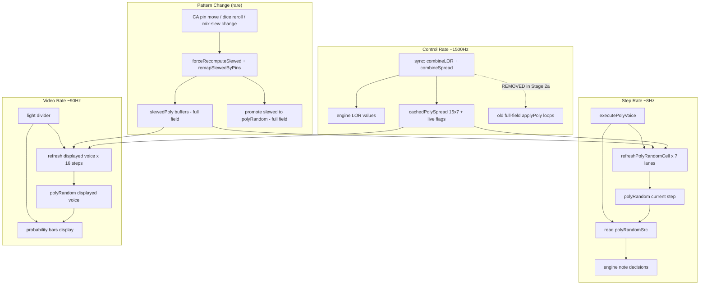

# Spread / Copula Performance — Implementation Pipeline

**Authoritative source:** [`docs/design/SPREAD_PERFORMANCE_PLAN.md`](../docs/design/SPREAD_PERFORMANCE_PLAN.md)
This doc is the implementation detail companion. The design doc is the single source of truth.

## Root Cause (measured + code-confirmed)

- Per-cell spread apply `SpreadInterp::applyPoly` -> `interpolate` -> `copula::mix2` -> `combine`
  ([`GaussianCopula.hpp:111-114`](../src/dsp/GaussianCopula.hpp:111)) does **2x exact PhiInv + 1x exact
  Phi(erfc) in DOUBLE, per cell.**
- `combine`/`mix2` do NOT use the fast `PhiLUT` -- only the slew readout (`applyZ`, `PhiFast`) does.
- Full spread field (~7 lanes x 15 voices x 16 steps = ~1680 cells) recomputed at CONTROL rate
  (~1500Hz) in [`sync()`](../src/dsp/managers/MonsoonExpanderManager.cpp:56) -> ~2.5M mix2/sec,
  each with 3 exact transcendentals.
- **MinGW's `erfc` is pathologically slow** (hence `PhiLUT` was built for the slew readout).
- Measured: `process` ~6500ns idle / ~10500ns running (~30-50% of 20800ns/sample budget).

## Key Facts

- **Every consumer reads only a SLICE, never the full field:**
  - Engine (probability/Lantern/prob-outs): **current step only, all voices, all lanes** at **STEP rate**
  - UI (Sands/Macro bars): **displayed voice x all lanes x 16 steps** at **VIDEO rate**
  - Nothing reads all-voices x 16-steps at control rate -- that combination serves no consumer.
- **Reversibility does NOT require exact Phi** -- only the SAME Phi forward and back. The LUT is
  deterministic; round-trip is bit-exact by construction as long as forward and reverse spread both
  use the identical LUT.
- Spread/mix2 is downstream of the draw (not part of the reversible DRAW bit-identity). The slew
  readout already uses `PhiLUT` safely. Spread is the same class -> LUT-safe.

---

## THE PLAN -- ordered by value/effort. Measure after each stage.

### Stage 1 -- Fast PhiLUT + new PhiInvLUT for mix2 (biggest win on MinGW, smallest change, shared)

Removes the slow MinGW erfc/PhiInv from the per-cell path. Reversibility preserved (same LUT fwd and back).

**Current code** ([`GaussianCopula.hpp`](../src/dsp/GaussianCopula.hpp)):
- `PhiLUT` (lines 40-66): 4096-entry half-range table over [0,6], float, linear interp, symmetry.
  Already used by `PhiFast` for the slew readout. **Exists, working.**
- `PhiInv` (lines 78-107): Acklam rational approx + Halley refinement. Uses exact `Phi()` (erfc) in
  the refinement step. Has `sqrt` + `log` calls. **Exact, slow on MinGW.**
- `combine` (lines 111-115): `z = SUM w[j] * PhiInv(u[j])`, `return Phi(z)` -- 2x PhiInv + 1x Phi
  per `mix2` call. **Uses EXACT transcendentals -- the hot path cost.**
- `mix2` (lines 120-126): short-circuits at |rho| > 0.9999, else calls `combine` with 2 sources.

**What to build:**

1. **Build `PhiInvLUT`** (new) -- mirror the existing forward `PhiLUT`:
   - 4096-entry table over p in [U_EPS, 1-U_EPS], built once from exact `PhiInv`
   - Linear interpolation, clamp to `U_EPS` bounds ([`GaussianCopula.hpp:79-80`](../src/dsp/GaussianCopula.hpp:79))
   - Care at TAILS (PhiInv -> +/-inf near 0/1); tabulate within the clamped range
   - Expose `PhiInvFast(p)` -- same API as `PhiInv` but LUT-backed

2. **Route `combine()` through the LUTs:**
   ```cpp
   inline double combine(const double* u, const double* w, std::size_t n) {
       double z = 0.0;
       for (std::size_t j = 0; j < n; ++j) z += w[j] * PhiInvFast(u[j]);  // was PhiInv
       return PhiFast(z);                                                  // was Phi
   }
   ```
   Keep the double mix arithmetic; only the transcendentals become lookups.

3. **SHARED WIN:** route other hot-path exact `PhiInv` calls through `PhiInvFast` too -- check
   [`PatternEngine.cpp`](../src/dsp/engines/PatternEngine.cpp) draw/slew paths. One LUT, two
   beneficiaries (spread mix2 AND slew/mix).

4. **Warm-up:** call `PhiInvLUT::table()` from `plugin.cpp init()` alongside the existing
   `warmPhiLut()` call, so the one-time table build happens off the audio thread.

5. **Reversibility rule:** forward spread and reverse spread MUST use the identical LUT path.
   Verify the reverse spread goes through the same `PhiFast`/`PhiInvFast`, not exact.

6. **Validate:** distribution tests must run through the LUT; round-trip/reversibility tests must
   stay bit-exact (same-LUT-both-ways guarantees this). Measure `process` avgNs -- expect a large
   drop (kills MinGW erfc x3/cell).

**Files:**
| File | Change |
|------|-------|
| [`GaussianCopula.hpp`](../src/dsp/GaussianCopula.hpp) | Add `PhiInvLUT` struct + `PhiInvFast()`, route `combine()` through LUTs |
| [`plugin.cpp`](../src/plugin.cpp) | Add `warmPhiInvLut()` call in `init()` |

**Verify:** `process avgNs` drops substantially (per-call cost reduced). Reversibility round-trip
bit-exact. Distribution tests pass.

---

### Stage 2 -- Restructure: compute only the slices each consumer reads

Only if Stage 1 isn't sufficient (Stage 1 reduces per-call cost; this reduces call COUNT ~250x).
Do in sub-stages with bit-compare after each -- this is the hard-won spread/correlation path.

#### Stage 2a -- Engine slice (biggest win, highest regression risk)

**Goal:** Move engine's spread application from control-rate full-field to step-rate current-step.

**What changes:**

1. **Add spread cache to PatternEngine** ([`PatternEngine.hpp`](../src/dsp/engines/PatternEngine.hpp:128)):
   ```
   float cachedPolySpread[15][7] = {};   // [voice][engineLane] = blended spread from combineSpread
   bool cachedSpreadLiveR = true;        // rhythm axis (REST/ACC/VAR/LEG)
   bool cachedSpreadLiveM = true;        // melody axis (MEL/OCT)
   bool cachedSpreadLiveQ = true;        // QMIX own axis (SB_SANDS_Q)
   ```

2. **In [`sync()`](../src/dsp/managers/MonsoonExpanderManager.cpp:56):**
   - KEEP: `combineLOR` calls (writes LOR to engine -- needed for step index computation)
   - KEEP: `combineSpread` calls (computes the blended spread value)
   - KEEP: `polySpreadEffective[v][lane] = interp` writes (UI display, cheap)
   - ADD: `engine.pe.cachedPolySpread[v][lane] = interp` (cache the spread value)
   - ADD: `engine.pe.cachedSpreadLiveR/M/Q` = lock state per axis
   - REMOVE: all `for (int j = 0; j < 16; j++) polyRandom(v, lane)[j] = applyPoly(...)` loops
     (7 loops x 15 voices = the 1680-cell expensive part)

3. **Add `refreshPolyRandomCell` to SequencerEngine** ([`SequencerEngine.hpp`](../src/dsp/engines/SequencerEngine.hpp:529)):
   ```cpp
   void refreshPolyRandomCell(int voice, int engLane, int step);
   // In .cpp (where both PatternEngine + SpreadInterp are available):
   //   - Check cachedSpreadLive for this lane's axis; if not live, return (leave frozen value)
   //   - polyRandom(voice, engLane)[step] = SpreadInterp::applyPoly(pe, engLane, voice, step,
   //       pe.cachedPolySpread[voice][engLane]);
   ```

4. **In [`executePolyVoice`](../src/dsp/engines/SequencerEngine.cpp:943):**
   - At the top, compute all 7 step indices (restIdx, melIdx, octIdx, accIdx, qmixIdx, varIdx, legIdx)
   - Call `refreshPolyRandomCell` for all 7 lanes at their respective step indices
   - Existing `polyRandomSrc` reads then return the just-refreshed values
   - NOTE: step indices are currently computed at different points in the function. Either (a)
     compute all 7 at the top, or (b) refresh before each read site. Option (a) is cleaner.

**What stays unchanged:**
- `processDNA` standalone-Macro spread path (lines 675-686) -- only runs without East
- `processDNA` mono spread path (lines 658-671) -- only 16 cells, cheap
- `remapSlewedByPins` promotion (slewed -> polyRandom) -- only when CA pins change
- `sandsActive` flag and PatternEngine's `!sandsActive` copy
- All UI reading code

**Correctness argument:** `applyPoly` reads from the **slewed buffer** (`polySlewed`), NOT from
`polyRandom`. The cached spread value is from the most recent `sync()` call. The slewed buffer
hasn't changed since that `sync()` call (it only changes inside `processDNA` which runs before
`sync()` in the same control block). Under lock, both paths skip the write (frozen value persists).

**Verify:** Bit-compare engine probability output against current (same seed/pattern) -- MUST be
identical. `process avgNs` drops further. `applyPoly` calls/sec drops from ~2.5M to ~392.

#### Stage 2b -- UI slice (display only, lower risk)

**Goal:** Compute displayed voice's probability bars at video rate (light divider ~90Hz).

**What changes:**

1. **In [`Monsoon::process()`](../src/Monsoon.cpp:1081) light divider block:**
   - Determine the displayed voice (from the Sands visual editor's voice tab)
   - For the displayed voice x all 7 lanes x 16 steps:
     ```
     for (int lane = 0; lane < 7; ++lane)
       for (int step = 0; step < 16; ++step)
         engine.pe.polyRandom(displayedVoice, lane)[step] =
           SpreadInterp::applyPoly(engine.pe, lane, displayedVoice, step,
             engine.pe.cachedPolySpread[displayedVoice][lane]);
     ```
   - ~112 cells x 90Hz = ~10,080 applyPoly calls/sec (trivial)

2. **Handle voice tab switch:** Set a `uiVoiceDirty` flag on tab switch; the light divider block
   checks it and refreshes immediately.

3. **Handle mono voice display:** The mono voice (V1) uses the mono arrays (`rhythmRandom`, etc.),
   not `polyRandom`. Its spread is already applied in `processDNA` (cheap, 16 cells). No change needed.

**Verify:** Turn mix/slew/spread knobs -> bars update smoothly at video rate. Switch voice tab ->
new voice's bars recomputed immediately. Display matches engine at step points.

#### Stage 2c -- Remove dead full-field control-rate rebuild

Once 2a + 2b serve both consumers, the original `sync()` full-field pass is dead -- delete it.

1. Remove any remaining dead code from the old full-field path in `sync()`
2. Address `processDNA` standalone-Macro spread path (lines 675-686): cache spread values (same
   approach as `sync()`) and let step-rate + UI-rate handle it, or leave as-is if rare enough
3. Final cleanup of comments referencing the old full-field rebuild

**Verify:** No consumer regressed. `process avgNs` at target.

---

### Stage 3 -- SIMD (only if Stages 1+2 still short; likely unnecessary)

Rack's `rack::simd::float_4` vectorises the per-voice apply 4-at-a-time IF single precision is
acceptable AND the LUT path is used (float LUT output). The restructure's current-step slice
produces a contiguous per-voice (SoA) array that `float_4` can load. Decide by measurement after
Stage 1+2, NOT before.

---

## Do NOT

- Do NOT make the copula float to "save precision cost" -- double mix arithmetic is cheap; the cost
  was the transcendentals (fixed by LUT) and the call count (fixed by restructure).
- Do NOT change forward spread without changing reverse identically (breaks reversibility).
- Do NOT restructure (Stage 2) monolithically -- bit-compare after 2a and 2b.
- Do NOT reach for SIMD before Stage 1+2 measurement.

## Verify Targets

- `process avgNs` -> a few hundred (from 6500-10500)
- mix2/applyPoly transcendental cost -> ~0 (LUT lookups, Stage 1); call count -> ~thousands/sec (Stage 2)
- Reversibility round-trip bit-exact; distribution tests pass
- UI bars update live at video rate on mix/slew/spread knob turns

---

## Data Flow Diagram



## Key Files

| File | Stage 1 | Stage 2a | Stage 2b | Stage 2c |
|------|---------|----------|----------|----------|
| [`GaussianCopula.hpp`](../src/dsp/GaussianCopula.hpp) | Add `PhiInvLUT`, route `combine` | | | |
| [`plugin.cpp`](../src/plugin.cpp) | `warmPhiInvLut()` | | | |
| [`PatternEngine.hpp`](../src/dsp/engines/PatternEngine.hpp) | | Add cache fields | | |
| [`SequencerEngine.hpp`](../src/dsp/engines/SequencerEngine.hpp) | | `refreshPolyRandomCell` decl | | |
| [`SequencerEngine.cpp`](../src/dsp/engines/SequencerEngine.cpp) | | Implement + call in `executePolyVoice` | | |
| [`MonsoonExpanderManager.cpp`](../src/dsp/managers/MonsoonExpanderManager.cpp) | | Remove loops, add cache writes | | Cleanup |
| [`Monsoon.cpp`](../src/Monsoon.cpp) | | | UI refresh in light divider | |
| [`MonsoonSandsManager.cpp`](../src/dsp/managers/MonsoonSandsManager.cpp) | | | | Standalone-Macro path |
| [`SpreadInterp.hpp`](../src/dsp/SpreadInterp.hpp) | No change (already per-cell) | | | |

## Risk Mitigation

- **Stage 1 is low risk** (LUT swap, reversibility preserved by same-LUT-both-ways)
- **Stage 2a is the highest risk** (touches the engine's probability read path)
- **Bit-compare guard:** Before Stage 2a, capture engine output (probabilities, gate decisions)
  with a known seed/pattern. After Stage 2a, verify bit-identical output.
- **If Stage 1 alone is enough** (process avgNs acceptable), pause before Stage 2
- **Stages are independently testable** -- each can be committed separately
- **The hard-won spread/correlation correctness** is protected by the bit-compare
