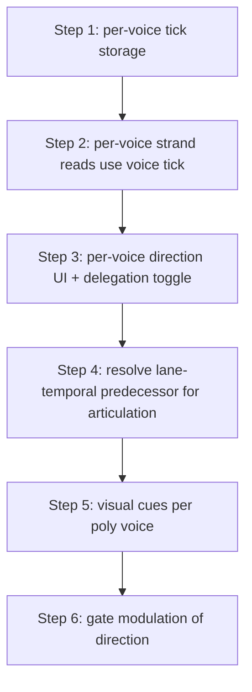

# Per-lane direction — code audit vs LANE_DIRECTION_REVERSE.md + rollout roadmap

## Audit: doc vs code (what's actually implemented)

### ✅ Mono (V1) per-lane direction — FULLY WIRED
The mono strand reads use the per-lane tick, not the global one:
- [`getRhythmStep/getVariationStep/getLegatoStep/getAccentStep/getMelodyStep/getOctaveStep`](plugins/Melodicer/src/dsp/engines/SequencerEngine.cpp:874) all call `getStrandIdx(laneTick_[strand], …)` — the per-lane accumulated tick.
- [`advancePlayhead`](plugins/Melodicer/src/dsp/engines/SequencerEngine.cpp:104) advances each `laneTick_[l]` by `dir * laneSign_[l]` (sign = +1 follows global, −1 reverse).
- All-forward keeps `laneTick_[l] == totalStepsElapsed` exactly → no-op until a lane is reversed (the doc's invariant holds).
- **UI**: `LaneDirItem` / `FlipQuantItem` in [`MonsoonWidget.cpp:736`](plugins/Melodicer/src/MonsoonWidget.cpp:736) set `laneSignPending_[strand]`; pendulum toggles `lanePendulum_[strand]`; flip-quant choice. All 6 strands (MEL/OCT/REST/ACC/VAR/LEG).
- **Promotion**: pending → active at boundary per `laneFlipQuant` (StepEdge = every step; Phrase = window wrap). Pendulum flips in place at the wrap, keeping pending in sync.
- **Persistence**: [`MonsoonPersistenceManager`](plugins/Melodicer/src/dsp/managers/MonsoonPersistenceManager.cpp:34) saves `laneSignPending_[]`, `laneFlipQuant`, `lanePendulum_[]`.
- **Visual cue**: Mono visual applies `setPlayDir(globalDir * laneSign_)` per lane ([`MonsoonSandsVisualExpander.cpp:358`](plugins/Melodicer/src/MonsoonSandsVisualExpander.cpp:358)); editor `lanePlayDir[6]` + directional leading-edge marker per lane.

### ❌ Poly per-voice direction — NOT WIRED (deferred "step 6")
- [`getVariationStepForVoice`](plugins/Melodicer/src/dsp/engines/SequencerEngine.cpp:848) and [`getLegatoStepForVoice`](plugins/Melodicer/src/dsp/engines/SequencerEngine.cpp:857) (the Local-East per-voice reads) call `getStrandIdx(totalStepsElapsed, …)` — the GLOBAL tick, ignoring per-lane direction.
- The poly LOR reads (`polyLenE`/`polyOffE`/`polyRotE`) feed `getStrandIdx` with `totalStepsElapsed` too — no per-voice tick exists.
- Confirmed by the East widget comment: "Poly tabs read forward for now (per-voice direction is deferred, step 6)" ([`StraitsEastSandsVisual.cpp:843`](plugins/Melodicer/src/StraitsEastSandsVisual.cpp:843)).
- So today: reversing a mono lane affects ONLY mono (V1). Poly voices keep reading forward on every lane regardless of the mono lane sign.

### ⚠️ Latent invariant tension (doc open idea #1, unaddressed)
The doc's invariant #2 ("classify by the temporal predecessor") currently uses the GLOBAL `prevPlayedDec` ([`SequencerEngine.cpp`](plugins/Melodicer/src/dsp/engines/SequencerEngine.cpp) connect branch). But once a lane is reversed, **that lane's** temporal predecessor diverges from mono's global one. Today this is masked because only the *read position* (laneTick_) is per-lane, while *articulation classification* (legato/tie/rest) is still global/mono. So a reversed REST lane can read a different cell while mono's connect decision is based on the global predecessor — a reversed-lane note can "connect" to a cell that isn't its lane-temporal predecessor. Not yet audible as a bug (mono articulation is global), but it's the design cost the doc flags, and it MUST be resolved before per-voice direction (where the divergence is per-voice, not just per-lane).

### ❌ Modulation via gates — NOT BUILT
The doc lists pendulum (built) but no gate-triggered direction flip. The Gate Assign menu ([`MonsoonWidget.cpp:926`](plugins/Melodicer/src/MonsoonWidget.cpp:926)) has no direction entry. No gate input flips a lane sign.

## Roadmap: the next major steps

### Step 1 — Per-voice tick storage
Add `laneTickV_[15][6]` and `laneSignV_[15][6]` (15 poly voices × 6 strands) to `SequencerEngine`, mirroring the mono `laneTick_[]`/`laneSign_[]`. Default sign +1 (follow global/mono). All-forward keeps `laneTickV_[v][s] == laneTick_[s]` (no-op). Advance in `advancePlayhead` alongside the mono loop. This is the storage layer; reads still use mono's tick until step 2.

### Step 2 — Per-voice strand reads use the voice tick
Route `getVariationStepForVoice` / `getLegatoStepForVoice` AND the poly LOR reads through `laneTickV_[bank][strand]` instead of `totalStepsElapsed`. Delegation (follow-mono) = use mono's `laneTick_[strand]`; Local East = use the voice's own `laneTickV_[bank][strand]`. Same delegation shape as VAR/LEG already use. This makes a reversed mono lane + a delegated poly voice stay in sync, and a Local-East poly voice reverse independently.

### Step 3 — Per-voice direction UI + delegation
Mirror the VAR/LEG delegation pattern: a per-voice "direction: follow mono / local" toggle on the East visual (owner cell or context menu), plus the sign flip. Storage parallels `varlegLocalEast_` → `dirLocalEast_[15][6]` + `dirSignPendingV_[15][6]`. East widget binds + syncs per-voice like it does for VAR/LEG attens. Default = follow mono (silent).

### Step 4 — Resolve lane-temporal predecessor (the hard one)
Per the doc's invariant #2, articulation on a reversed lane must classify against THAT lane's temporal predecessor, not the global one. For mono this means tracking a per-lane `prevPlayedDecLane_[6]` (the decision the lane's tick last landed on). For poly, a per-voice-per-lane predecessor. This is the design cost the doc explicitly flags. Options:
- (a) Per-lane predecessor state (heavier, fully correct).
- (b) Keep articulation global but document that reversed lanes only affect the *read window* (position), not articulation classification — simpler, accepts the divergence as a known limitation for musical reverse (retrograde read of an already-decided pattern).
Recommend (b) for the first rollout (matches how mono already works — direction affects the cell read, articulation stays global) and revisit (a) if a reversed-lane isolated-teal appears.

### Step 5 — Visual cues per poly voice
East/Macro/Lantern: each poly voice's lane reads its own direction (`globalDir * laneSignV_[v][s]`) for the leading-edge marker + playhead cue, like the mono editor already does per lane. Lantern's `playDir` per cell already supports this (it stores per-cell). East's `lanePlayDir[]` is currently per-editor-lane; extend to per-voice when the voice's direction is local.

### Step 6 — Gate modulation of direction
Add direction-flip actions to the Gate Assign menu (and/or a dedicated gate input): "flip lane X direction" / "flip voice Y lane X". A gate edge toggles `laneSignPending_[s]` (mono) or `dirSignPendingV_[v][s]` (poly), promoted at the next boundary per flip-quant. Reuses the pending→active promotion already in `advancePlayhead`. This is the "modulation via gates" goal — cheap once steps 1–3 land, because the promotion machinery exists.

## Recommendation
Start with **Steps 1+2** (storage + reads) — they're mechanical, mirror the existing mono/VAR-LEG patterns, and immediately make a reversed mono lane propagate to delegated poly voices (the most common case). Defer the per-voice *independent* direction (step 3) and the predecessor question (step 4) until the delegated case is validated. Gate modulation (step 6) is the natural finale since it's just a trigger into the pending-sign machinery.
