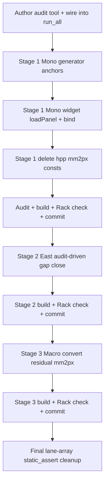

# Sands widgets → SvgPanelKit bind-by-name — migration plan

Companion to `sands_mono_anchor_vs_bind_diff.md`. One module at a time,
**Mono → East → Macro**, commit + Rack-check between each. The goal is a single
geometry source (the generator) with a build-time audit that turns "a control is
missing" from a hover-discovery into a compile/CI failure.

## Invariants (apply to all three modules)

- Generators emit a kit anchor for **every** control: `param_*` / `input_*` /
  `output_*` / `light_*`, editor-lane indexed, visible (never `display:none`).
  Anchors are **descriptive** (`param_atten_<el>_<col>`), not bare-numeric, so
  StoreKnobs (which have no paramId) can be bound by `bindWidget(name, ptr)`.
- Widgets `loadPanel(...)` (populates the shape cache) — never
  `setPanel(createPanel(...))`. Widget classes compose
  `dotModular::Compose<W, ShapeQuery, Bind, Reload>` (Mono does not yet; East and
  Macro already do).
- Every control is placed by `centerOf(findNamed("<anchor>"))`. All `mm2px`
  X-constants and `rowY()` are **deleted** from the `.hpp`.
- Labels derive from anchors: `centerOf(findNamed(...))`, never recomputed
  geometry. Names come from `SandsLaneNames.hpp` (already the single source).
- Lane counts come from `SandsGrid::MONO_LANES` / `POLY_LANES` on BOTH sides
  (widget loop bound AND generator loop bound), with `static_assert` on table
  lengths. Stop mixing local `N_LANES`/`N_SPREAD_LANES` with the SandsGrid
  constants in the same file.

## Deliverable that makes it stick — the anchor-vs-bind audit (build in first)

A standalone tool + CI step, authored BEFORE touching Mono placement so the
migration is verified as it lands:

- `test/audit_anchor_bind.py` — parse each generated SVG `components` layer for
  ids; parse the widget's `bind*("name", …)` / `findNamed("name")` calls; assert
  **every anchor has a bind AND every bind resolves to an anchor**. Also assert
  anchor counts equal `SandsGrid` constants.
- Wire into `test/run_all.sh` so `bash test/run_all.sh` fails on any mismatch.
- Rationale: this is the guard that prevents the whole q-mix regression class from
  ever recurring — the two geometries can no longer silently diverge.

## Stage 1 — Mono (least broken; do first)

Files: `panel_src/gen_macro_mono.py` (`gen_mono`), `MonsoonSandsVisualExpander.hpp`,
`MonsoonSandsVisualExpander.cpp`.

1. **Generator**: replace numeric `kit_shape` anchors with descriptive names —
   `param_atten_<el>_<col>` (21), `input_cv_<el>_<col>` (21), `param_spr_<sidx>`
   (5), `input_sprcv_<sidx>` (5), `param_spratten_<sidx>` (5). Add the missing
   `param_owner_<lane>` (5, Class B). Keep the already-correct
   `param_dir_<lane>` / `input_dir_mod_<lane>` / `input_deleg_mod_<lane>` /
   `output_prob_<lane>`. Add `param_editor_recess` (box anchor for the editor).
   Re-render dark + light SVGs.
2. **Widget class**: change base to compose `ShapeQuery, Bind, Reload`; switch
   `setPanel(createPanel(...))` → `loadPanel(...)`.
3. **Widget ctor**: replace every `mm2px(Vec(CONST_X, rowY(...)))` with
   `centerOf(findNamed("<anchor>"))`. StoreKnobs: place via helper then
   `bindWidget`; CV/prob jacks: `bindInput`/`bindOutput` by name. Editor box from
   `boundsOf(findNamed("param_editor_recess"))`.
4. **.hpp**: delete `JACK_X`, `ATTEN_X`, `SPR_*_X`, `OWNER_X`, `DIR_X`,
   `DIR_MOD_X`, `DELEG_MOD_X`, `PROB_OUT_X`, `rowY()`. Keep the id enums (paramIds
   still needed for CV/prob jacks). Confirm `static_assert`s tie any remaining
   arrays to `SandsGrid`.
5. **Audit + build + tests + Rack-check.** Commit: "Sands Mono: bind-by-name via
   SvgPanelKit; delete mm2px geometry".

## Stage 2 — East

File: `StraitsEastSandsVisual.cpp` (+ `.hpp`, `gen_east_clean.py`). East already
`loadPanel`s and binds SOME controls, but the user reports **still-missing
controls + wrong labels**. Run the Stage-1 audit against East FIRST to enumerate
exactly which anchors lack binds / which binds lack anchors, then close each gap
the same way (descriptive anchors, `centerOf`-derived labels). Commit +
Rack-check.

## Stage 3 — Macro

File: `StraitsSandsMacroVisual.cpp` (+ `.hpp`, `gen_macro_mono.py::gen_macro`).
Most broken; the MIX-IN block was already moved to anchor-derived this session, so
the remaining work is applying the audit and converting any residual `mm2px`
placements. Commit + Rack-check.

## Only after all three are bound — revisit lane arrays

With a single geometry source, do the final lane-array cleanup: `static_assert` on
every table length against `SandsGrid::MONO_LANES` / `POLY_LANES`, and remove the
local `N_LANES` / `N_SPREAD_LANES` duplicates in favour of the SandsGrid
constants. This is deliberately LAST so it's done against one source, not two.

## Sequence summary

