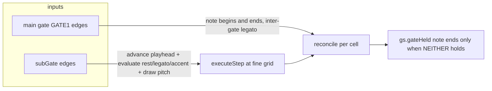

# subGate (gate subdivision) — dev plan (branch off master)

Source spec: [`docs/design/GATE_SUBDIVISION_STEP_GATE.md`](../docs/design/GATE_SUBDIVISION_STEP_GATE.md).
User name for the feature: **subGate** — a resolution clock, deliberately NOT called
STEP_GATE to avoid the near-homonym with the existing generated step-legato OUTPUTs
(`STEP_GATE_OUTPUT`, `gsStep`, Straits `POLY_STEP_GATE_OUT`, Changi T2/T3).

**Input source: Gate 3** (`GATE3_MOD_INPUT`) — already on the Monsoon panel. In modes B
(sequencer, main gate = Gate 1) and D (quantiser, main gate = Gate 2), Gate 3 becomes the
subGate clock. In other modes (A/C/E/F) Gate 3 keeps its current die-action role
(`gate3Target` menu / `gate3Trig`). **No new jack, no panel change, no new input enum.**

## Scope (confirmed with Rodney)
1. **Auto-raise.** Patching subGate automatically makes the playhead advance at the subGate
   rate; every main gate is subdivided at that resolution. Unpatched = today's behaviour
   (playhead advances one step per main-gate edge).
2. **All Sands lanes draw at subGate onsets.** At each subGate onset inside a main gate the
   engine does exactly what it does at a clock step: rest/legato/accent evaluated,
   melody/octave/q-mix drawn, Tie/Legato emergent from pitch equality, quantiser CV sampled.
   Pitch default is **ratchet** (a fresh draw that equals the held pitch reads as Tie; a
   different draw as Legato/NewNote — the existing engine rule, applied at the fine grid).
3. **GATE mode (B) + QUANTISER-gate mode (D) only.** NOT clock (A/C), NOT phase (E/F). Phase
   keeps PPQN; the doc's §"Phase mode" is explicit — do not wire subGate there.
4. **MONO first, then poly in the SAME branch.** Mono lands and verifies; poly (per-voice,
   correlated/reversible via Straits) + the Changi T2/T3 step outputs are folded into this
   branch as a later phase after mono is solid (not a separate branch).

## Branch
`feat/subgate-mono` off `master` (current work sits on `feat/raffles-cleanup-qmix`; this is a
clean, unrelated feature — branch from master so it merges independently).

---

## The core model (what actually changes in the engine)

Today (Mode B, [`SequencerEngine::executeModeB`](../src/dsp/engines/SequencerEngine.cpp:695)):
one **main-gate RISE** → `advancePlayhead()` + `executeStep()` (one step = one incoming gate).
The module layer ([`Monsoon.cpp:868-884`](../src/Monsoon.cpp:868)) then drives `gs.gateHeld`
from Gate 1 level every sample (IMPL 2b), so the gate WIDTH is the external gate's width.

With subGate patched, the two streams separate (spec §"Two edge streams"):
- **subGate edges** advance the playhead, define the fine grid, and are WHERE
  rest/legato/accent are evaluated + all pitch lanes are drawn (a `executeStep` per subGate
  onset).
- **main-gate edges** mark where note EVENTS begin and end in the incoming material — a note
  spanning N subGate cells is length N; rest can drop a cell; legato at each internal
  boundary decides tie vs re-articulate.

**Two tie scopes, both preserved (the subtle requirement, spec §"TWO tie scopes"):**
- *Intra-gate legato* — tie across subGate cells WITHIN one main gate (the subdivision case;
  the step-legato analogue).
- *Inter-gate legato* — tie across a MAIN-GATE boundary (the slur-across-notes the module
  already does in plain Mode B). **Must still work.**
- Rule: at a subGate edge inside a gate → intra-gate decision; at a main-gate edge →
  inter-gate decision. A note ENDS only when NEITHER says hold.
- **TRAP:** subGate must NOT force a re-articulation at every main-gate edge just because it
  is also a subGate boundary — that silently breaks inter-gate slurs (a today-capability).

### Alignment / robustness decisions (spec §"Alignment", baked in)
- **Off-grid main-gate edges:** quantise note start/end to the nearest subGate edge (the
  reason subGate was patched). Make it the explicit, only behaviour for v1.
- **subGate (Gate 3) stalls while main gates keep arriving:** playhead FREEZES (Gate 3 is the
  declared clock in B/D). Unpatch/repatch handover: when Gate 3 disconnects in B/D, revert to
  main-gate-drives-playhead on the next main-gate edge (clean fallback, no half-state).
- **Display:** the Sands/Lantern playhead must read the SAME resolved step the engine uses
  (published `stepIndex`/`gs` state), not a separately computed position — this is the
  display/engine race that bit the spread work. Under subGate it moves at the fine rate
  because the engine's `stepIndex` does.

### Accent (spec §"Accent") — no new output
Accent FOLLOWS THE ARTICULATION: asked only at ONSETS (fresh onset at a main-gate edge, or a
fresh onset at a subGate re-articulation). A tied continuation is not an onset → no re-accent.
This is automatic once `executeStep` runs at subGate onsets — no accent clock, **no
STEP_ACCENT output** (decided/declined in the spec).

### Pitch (spec §"Pitch") — ratchet default, Tie emergent
All Sands lanes draw at each subGate onset on the clock-mode step rules. Tie vs Legato is
pitch-equality (engine already does this — [`MonoDecision`](../src/dsp/engines/SequencerEngine.hpp:19)
Tie=same pitch, Legato=new pitch, NewNote=retrigger). The legato lane decides
retrigger-vs-not. Quantiser (Mode D) samples the incoming CV at each subGate onset, so a
repeated incoming pitch naturally yields a Tie.

---

## Where the code changes land (verified against the tree)

**No new jack / panel / input enum.** Gate 3 (`GATE3_MOD_INPUT`) is the subGate source.

| Area | File | Change |
|---|---|---|
| Gate 3 edge routing | [`Monsoon.cpp:683-690`](../src/Monsoon.cpp:683) (the `gate3Trig` block) | mode-dependent: in B/D, Gate 3 rise → subGate clock (advance playhead at fine grid); in A/C/E/F, Gate 3 rise → die action (unchanged). The `gate3Trig` edge detect already exists. |
| Dispatch gating | [`Monsoon.cpp:762`](../src/Monsoon.cpp:762) `shouldExecute` for modeSelect 1 (B) and 3 (D) | when Gate 3 connected in B/D: step on the subGate (Gate 3) rise instead of `gate1Rise`/`gate2Rise`; the main gate (Gate 1 in B, Gate 2 in D) is tracked as the note-event stream separately |
| Mode B/D step driver | [`ModeController::executeModeB/D`](../src/dsp/managers/MonsoonModeController.cpp:306) | route the fine-grid step through the SAME `executeStep` path; pass main-gate state so the engine reconciles note begin/end |
| Engine reconciliation | [`SequencerEngine::executeModeB`](../src/dsp/engines/SequencerEngine.cpp:695) + [`GateState`](../src/dsp/gates/GateState.hpp:42) | the two-edge-stream logic: advance on subGate; open/extend/close note from BOTH streams (intra vs inter tie scopes) |
| Module gate driver (IMPL 2b) | [`Monsoon.cpp:868-884`](../src/Monsoon.cpp:868) | extend the `gateOpen` expression so a note ends only when NEITHER the main gate NOR intra-gate legato holds; do not let subGate force re-articulation at main-gate edges |
| Display parity | Lantern / Sands playhead read of `stepIndex`/`gs` | verify it reads published engine state (no separate position) |

**No panel work:** Gate 3's jack, anchor, and bind already exist on the Monsoon panel. The
`cachedGate3Connected` flag already exists ([`Monsoon.cpp`](../src/Monsoon.cpp)). Reuse the
existing `gate3Trig` SchmittTrigger for the rising edge.

---

## Build phases (each ends compilable + `run_all.sh` green)

### Phase 0 — verify-before-building (spec §"Open question")
- Confirm in code what the engine reads TODAY at a step: `executeStep` runs rest→legato→
  accent→pitch draw→quantiser sample. Confirm step-legato currently only supplies boundaries
  WITHIN a committed slur (the extension is to let subGate govern ANY gate).
- Confirm the Mode B main-gate path (`executeModeB` + the IMPL 2b driver) is the SINGLE gate
  state source (it is — spec §5 SoT).
- Output: a short note in the plan confirming the entry points; NO code yet.

### Phase 1 — header-level engine test FIRST (spec §"Test", TDD)
Write `test/test_subgate.cpp` (synthetic edge streams, no Rack) BEFORE the engine change:
- (a) a main gate spanning N subGate cells → note length N; legato asked at N−1 internal
  boundaries.
- (b) in ONE pattern: a legato tie that HOLDS across a main-gate boundary AND one that
  re-articulates at a subGate boundary inside a gate — the test that catches subGate stomping
  inter-gate legato.
- (c) an off-grid main-gate edge quantising to the nearest cell.
- (d) unpatched subGate = byte-identical to today's Mode B (regression guard).
- Add to [`test/run_all.sh`](../test/run_all.sh) TESTS (companion: `$SE $GS $PE`).

### Phase 2 — engine: two-edge-stream reconciliation (mono)
- Add subGate-driven stepping to `executeModeB` (and the Mode D path via ModeController).
- Implement the intra-gate vs inter-gate tie-scope rule in the engine/GateState; a note ends
  only when neither holds.
- Off-grid quantise + subGate-stall freeze + unpatch handover.
- Make Phase 1 tests pass. `run_all.sh` green.

### Phase 3 — module wiring + panel
- `SUBGATE_INPUT` enum/config/edge-detect/InputState; dispatch gating; IMPL 2b `gateOpen`
  extension.
- Panel jack (generator + anchor + bind); anchor/bind audit green.
- Display parity check (playhead reads published state).

### Phase 4 — Rack verification (Rodney; container can't run Rack)
- Worked example: external seq mixing 1/8 + 1/16, send 1/16 clock to subGate → an 1/8 reads
  as two tied 1/16s; legato lane decides tie vs retrigger per the fine grid.
- Inter-gate slur across a main-gate boundary still works with subGate patched (the trap).
- Unpatched subGate = unchanged Mode B. Quantiser Mode D subdivides + samples CV per onset.
- Lantern shows the fine-rate playhead matching the audio.

### Phase 5 — docs
- Update the spec's "Open question" section to record the chosen answers (auto-raise; all
  Sands lanes at subGate onsets; gate+quantiser only; mono first; poly folded into this
  branch after mono lands).

---

## Explicitly OUT of scope (this branch)
- **Phase mode** — deliberately excluded (PPQN already is its resolution; spec §"Phase mode").
- **STEP_ACCENT output** — declined in the spec (derivable downstream if ever needed).
- **Internally-generated subdivision grid** (nothing patched) — rejected/deferred in the spec.
- **fresh-pitch ROLL opt-in** (vs ratchet default) — the per-voice/lane pitch fork; ratchet
  is the v1 default, the opt-in is a later refinement.

## Poly — folded into THIS branch after mono lands (phase order)
Mono phases (0-5) land and verify first. Then, in the same branch:
- **Phase P1** — per-voice edge reconciliation: each poly voice's `voices[i].gs`/`gsStep`
  subdivides under subGate (the correlated + reversible payoff — WHICH voices split moves
  with the correlation structure and reverses, because the decision is a seeded per-voice
  lane value; this is why it is internal, not a patch).
- **Phase P2** — Straits `POLY_STEP_GATE_OUT` / `POLY_STEP_LEGATO_GATE_OUT` already exist as
  OUTPUT jacks; verify they emit at the fine grid. Changi T2/T3 step outputs likewise.
- **Phase P3** — header test extension (per-voice subdivision + inter-voice correlation) +
  Rack verification.

## Risks / watch-items
- **Inter-gate legato regression** — the headline trap; the Phase 1 (b) test exists to catch
  it. Do not force re-articulation at a coincident main-gate + subGate edge.
- **Display/engine race** — publish one resolved step; the playhead must not recompute
  position (the spread-work bug class).
- **Rate discipline** — subGate is a new edge source; ensure mods sampled on the right edge
  (see [`EXTERNAL_GATE_ARTICULATION_CHECK.md`](../docs/design/EXTERNAL_GATE_ARTICULATION_CHECK.md)
  and RATE_DISCIPLINE_UNIFICATION) — the same "which edge samples the mod?" question.
- **Naming** — user-facing label **subGate** everywhere; keep it distinct from the existing
  STEP_GATE OUTPUT family in code comments to prevent future conflation.
