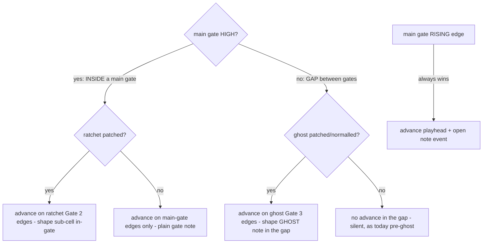

# subGate ghost notes — dev plan (extends subGate_ratchet)

Source spec: [`docs/design/GATE_SUBDIVISION_STEP_GATE.md`](../docs/design/GATE_SUBDIVISION_STEP_GATE.md).
Extends the shipped subGate work ([`plans/subgate_dev_plan.md`](subgate_dev_plan.md), branch
`feat/subgate-mono`).

## The gap this closes
The current subGate (ratchet) subdivides WITHIN a main gate's envelope — it can ratchet an 1/8 into
two 1/16s, tie, or drop a sub-cell. But it CANNOT place notes in the GAPS BETWEEN main gates. The
playhead advances through gaps but every gap cell is silent (preserve-decision). Ghost notes fill
those gaps: the fine grid outside the main gates becomes playable, with full rest/legato/accent/pitch.

## Gate topology — GATE mode (Mode B) ONLY (confirmed with Rodney)
| Gate | Role in GATE mode | Was |
|---|---|---|
| **Gate 1** | **main / primary gate** — REQUIRED (note events begin/end here) | main (Mode B) |
| **Gate 2** | **subGate_ratchet** — fine grid INSIDE main-gate envelopes | (was subGate on Gate 3) |
| **Gate 3** | **subGate_ghost** — fine grid OUTSIDE main gates; normals to the internal 1/16 clock | die-action (menu) |

- **Mode D unchanged:** quantiser-gate keeps Gate 2 = main + Gate 3 = ratchet-subGate (its current
  behaviour). The ghost/ratchet re-plumbing is GATE mode (Mode B) only.
- **Gate 3 die-action dropped in GATE mode only** (kept in A/C/E/F via the gate3Target menu).
- **Ghost normals to RATCHET (Gate 2)** when Gate 3 is unpatched — one cable (into Gate 2) drives
  both the in-gate ratchet and the in-gap ghost.  Patch Gate 3 separately only to give the ghost a
  DIFFERENT clock from the ratchet.
- Both subgates may be patched simultaneously; the main gate is always required.
- Ghost notes are just normal notes (no separate output/colour for now).

## Playhead driver — region-dependent (the core reconciliation)
The playhead advances on whichever edge stream governs the CURRENT region:

Rules (spec §"Playhead / edge tracking", extended):
- **Main-gate RISING edge always advances** the playhead and opens a note event (main gate wins when
  it arrives, even if it lands mid-ghost-cell — quantise to the edge, as ratchet does).
- **Inside a main gate** (main gate HIGH): ratchet (Gate 2) edges advance + shape sub-cells (today's
  behaviour). If ratchet unpatched, the playhead holds until the next main-gate edge (plain gate).
- **In a gap** (main gate LOW): ghost (Gate 3) edges advance + shape a GHOST note (rest/legato/accent/
  pitch, exactly a clock-mode step). If ghost unpatched, it normals to the internal 1/16 clock. If
  neither ghost patched nor normalled active, the gap is silent (today's preserve-decision).

## Legato flows BOTH ways across the ghost↔main boundary (the subtle requirement)
This is the ghost analogue of the ratchet's "two tie scopes". Legato is the leading-edge model
(`slurForward` committed at each onset), so it already composes — but verify each direction:
- **Ghost → main:** a ghost note high when a main gate arrives can legato INTO the main gate. The
  ghost onset committed `slurForward`; the main-gate onset sees `wasHeld` + `prevPlayedSounded` →
  connects (Tie/Legato). Same mechanism as the ratchet inter-gate slur.
- **Main → ghost:** a main gate can legato INTO a following ghost note. The main-gate note's onset
  committed `slurForward`; the first ghost onset in the gap connects back.
- **TRAP (same class as before):** the main-gate edge must NOT force a re-articulation just because
  it coincides with a ghost/ratchet edge — the leading-edge model handles this, but the test must
  cover ghost→main AND main→ghost slurs in one pattern.

## Alignment / robustness
- **Off-grid main-gate edges** land mid-ghost-cell: quantise to the nearest edge (same as ratchet).
- **Ghost + ratchet both patched:** the region test (`mainGateHigh`) selects which drives the
  playhead — ratchet in-gate, ghost in-gap. They never both drive the same cell.
- **Ghost stall (patched but no edges) with normalling:** if Gate 3 is patched but idle, the gap is
  silent (the patched stream is the declared clock — do NOT fall back to the normal). Normal only
  applies when Gate 3 is UNPATCHED.
- **Display parity:** the Lantern reads `stepIndex`/`gs` (published). Ghost cells advance stepIndex at
  the fine rate in the gaps too, so ghost notes render in their own cells (the gap-forStep fix already
  makes each advanced cell write its own column — extend so a ghost cell writes a real note, not the
  preserved-decision Inactive).

## Where the code changes land (extends the shipped subGate)
| Area | File | Change |
|---|---|---|
| Gate routing | [`Monsoon.cpp:683`](../src/Monsoon.cpp:683) | GATE mode (modeSelect==1): Gate 2 rise → ratchetRise, Gate 3 rise → ghostRise (drop die-action here). Gate 3 unpatched → normal ghost to internal 1/16 clock edge. Mode D (==3) + A/C/E/F unchanged. |
| InputState | [`Monsoon.hpp:65`](../src/Monsoon.hpp:65) | add `ratchetRise`/`ratchetConnected`, `ghostRise`/`ghostConnected` (rename/extend the current `subGateRise`/`subGateConnected`) |
| Dispatch gating | [`Monsoon.cpp:762`](../src/Monsoon.cpp:762) | GATE mode steps when: main-gate rise OR (in-gate ratchet rise) OR (in-gap ghost rise/normal). Compute the region + pick the driver. |
| Engine step | [`SequencerEngine::executeModeBSubdivided`](../src/dsp/engines/SequencerEngine.cpp:794) | extend signature: add `ghostRise` + which stream fired. In a gap, a ghost onset now SHAPES a note (executeStep) instead of preserve-decision. Main gate still wins on its rising edge. |
| IMPL 2b gate driver | [`Monsoon.cpp:868`](../src/Monsoon.cpp:868) | the fused-gate output must go HIGH on a ghost note (not just when main gate high). `gateOpen = !isRest && (mainGateHigh || ghostNoteSounding || slurForward)`. |
| Ghost normal | Monsoon.cpp routing | ghost normals to ratchet (Gate 2): ghostRise/ghostHigh = gate2Rise/gate2High when Gate 3 unpatched.  No internal clock needed. |

## Build phases (TDD, each ends compilable + `run_all.sh` green)
### Phase 0 — verify entry points (no code)
- Confirm the leading-edge `slurForward` model composes across ghost↔main (it should — it is
  onset-committed, region-agnostic). Confirm the current gap preserve-decision is the ONLY thing
  making gaps silent (so replacing it with a ghost-onset executeStep is the whole change).
- Confirm the internal 1/16 clock edge available in process() for the ghost normal.

### Phase 1 — test FIRST (extend test/test_subgate.cpp)
- Ghost onset in a gap shapes a note (rest/legato/accent/pitch), playhead advances.
- Ghost → main slur: ghost note high at a main-gate rise connects (Tie/Legato).
- Main → ghost slur: main note connects into the first ghost cell.
- TRAP: ghost→main AND main→ghost slurs in one pattern; no forced re-articulation at coincident edges.
- Ghost unpatched → normals to internal 1/16 (gap fills at 1/16).
- Ghost + ratchet both patched: ratchet drives in-gate, ghost drives in-gap (region select).
- Regression: ratchet-only (no ghost) = byte-identical to the shipped subGate.

### Phase 2 — engine: ghost onset shapes a note
- `executeModeBSubdivided` gap branch: on a ghost onset, run executeStep (shape the note) instead of
  preserve-decision. Keep the slur bridge + forStep-own-cell fixes.

### Phase 3 — module wiring
- Gate 2 = ratchet, Gate 3 = ghost (GATE mode); ghost normal clock; dispatch region select; IMPL 2b
  gateOpen includes ghost notes. Drop Gate 3 die-action in GATE mode.

### Phase 4 — Rack verification (Rodney)
- Gate 1 = 1/4 gates, Gate 2 = 1/16 ratchet, Gate 3 = 1/16 ghost → gaps fill with ghost 1/16s,
  in-gate ratchets to 1/16, slurs flow both ways. Unpatch ghost → gaps fill at internal 1/16.
  Unpatch both → plain gate. Lantern shows ghost notes in the gap cells.

### Phase 5 — docs (extend the spec with the ghost model + gate topology)

## Poly (fold in after mono, same as before)
Ghost notes flow through `executePolyVoices` the same way ratchet sub-cells do — each ghost onset is a
mono NewNote/Tie that drives per-voice rolls. Verify with poly test suites after mono ghost lands.

## Resolved decisions (Rodney)
- **Ghost note length = the ghost GATE's own width** (NOT a pre-determined nvIdx). A ghost note sounds
  for as long as Gate 3 is high — exactly the main-gate IMPL 2b model where gate width = external gate
  width. So ghost and main are SYMMETRIC: both are external gates whose level drives note duration,
  both go through executeStep, both use the leading-edge legato. This means the ghost note is driven by
  Gate 3's LEVEL (like main by Gate 1's level), not an internal countdown — nvIdx stays 6 (nullified,
  Mode-B style) and the gate width comes from IMPL 2b reading the ghost gate high.
- **Main gate arriving mid-ghost = NORMAL legato rules.** If the ghost committed slurForward → tie/
  legato into the main note; else the ghost note ends and the main note starts fresh. No special case —
  the leading-edge model handles it (e.g. a ghost 1/16 just before an 1/8 main note either connects
  into the 1/8 or ends and the 1/8 re-articulates).

## Consequence: the IMPL 2b gate driver is symmetric
`gateOpen = !isRest && (mainGateHigh || ghostGateHigh || slurForward)`.  The engine's executeStep runs
at each onset (main rise, ratchet edge in-gate, ghost rise in-gap); the fused-gate WIDTH comes from
whichever external gate is currently high (main or ghost) plus the slur bridge.  Ratchet stays as-is
(it re-articulates per sub-cell inside the main gate; the main gate's level still bounds it).
